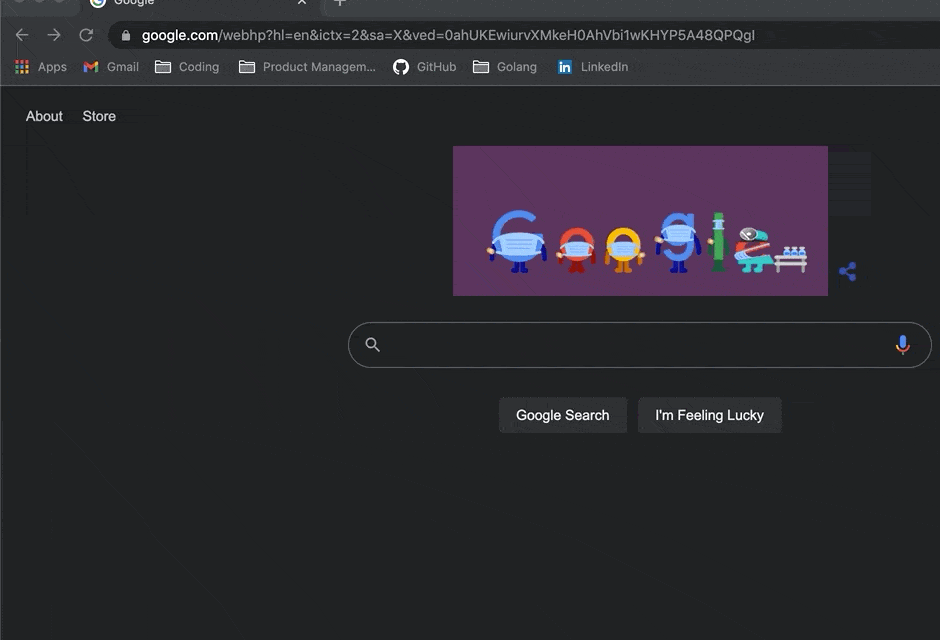

# ASCII ART WEB

#### A project by eternal17 & tb38r
---
 

### <ins>Table of Contents</ins>

1.    Description
2.    Authors
3.    Usage: how to run
4.    Implementation details: algorithm
 

---

### <ins>Description</ins>

Ascii art web uses Golang's HTML/Templates & net/HTTP packages to create an API that creates a static server & listens and responds to . An accompanying HTML file illustrates the client and provides the required inputs.
 
The primary aim is take a string from the user and return it to the client in Ascii form.
 

---

### <ins>Authors</ins>
tb38r: https://git.learn.01founders.co/tb38r
 
eternal17: https://git.learn.01founders.co/eternal17

---

### <ins>Usage: How to run</ins>

1. Within the project path: "go run .", to run the server. Server listens to localhost:8080.
2. In the web browser, go to localhost:8080
3. Here the user can chose between 3 banners, shadow, standard and thinkertoy.
4. In the text area below, the user can input up to 2 lines
5. After pressing submit, the ascii art version is returned with the banner chosen.

